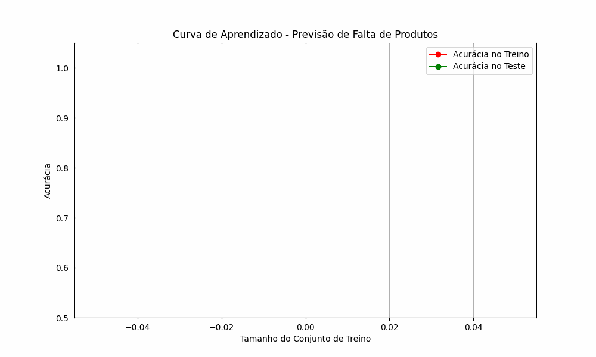

#Store Data Analysis

## 📌 Project Overview
This project analyzes a dataset from an Adidas store, processing and cleaning data, performing exploratory data analysis (EDA), feature engineering, and building machine learning models for price prediction and stock availability classification.

## 📂 Dataset Description
This dataset was sourced from **Kaggle** and contains detailed information about Adidas store products, including country-specific data, shoe metadata, and sales/stock details.
The project uses three CSV files:
- **`country_dim.csv`**: Contains country-related data.
- **`shoes_dim.csv`**: Contains metadata about shoes.
- **`shoes_fact.csv`**: Contains sales and stock information.

These datasets are merged into a SQLite in-memory database for efficient querying and processing.

## 🚀 Project Steps
### **1️⃣ Data Loading & Cleaning**
- Read CSV files into Pandas DataFrames.
- Store them in an SQLite database for structured querying.
- Remove redundant columns and rename necessary ones.
- Handle missing values in categorical variables (`sub_color1`, `sub_color2`).

### **2️⃣ Exploratory Data Analysis (EDA)**
- Analyze dataset structure and summary statistics.
- Visualize price distributions and category counts using Seaborn.
- Query stock availability and average price per category using SQL.

### **3️⃣ Feature Engineering**
- Extract **month** and **year** from date columns.
- Create **price range bins** to categorize prices.
- Generate **in-stock indicators**.
- Encode categorical variables using **One-Hot Encoding**.
- Compute **category and country product counts** for feature enrichment.
- Introduce **price-per-availability** as a new feature.

### **4️⃣ Price Prediction using Random Forest Regression**
- Train a **RandomForestRegressor** model to predict shoe prices.
- Compute **feature importance** to analyze the most relevant attributes.
- Evaluate the model using **Mean Squared Error (MSE)** and **R² Score**.

### **5️⃣ Stock Availability Classification**
- Convert `availability` into a **binary variable (`vai_faltar`)**, where `1` indicates a low stock level (≤2).
- Train a **RandomForestClassifier** to predict stock shortages.
- Assess performance using **accuracy, precision, recall, and F1-score**.

## 📊 Key Visualizations
- **Price Distribution Histogram**
- **Category Count Bar Chart**
- **Feature Importance Ranking (Top Features for Prediction)**
- **Learning Curve GIF (Model Training Visualization)**

### **📽 Learning Curve GIF**
To visualize how the model improves with more training data, refer to the generated learning curve animation:



## ⚡ How to Run the Project
### Prerequisites
Ensure you have the following Python packages installed:
```sh
pip install pandas numpy matplotlib seaborn sklearn imbalanced-learn sqlite3
```

### Running the Code
Simply execute the script in a Jupyter Notebook or as a standalone Python script:
```sh
python adidas_analysis.py
```

## 📌 Future Improvements
- Implement **hyperparameter tuning** for Random Forest models.
- Try **alternative models (XGBoost, LightGBM)** for better performance.
- Explore **time-series forecasting** for demand prediction.
- Improve **class imbalance handling** in stock prediction.

## 🛠 Technologies Used
- **Python** (Pandas, NumPy, Matplotlib, Seaborn, Scikit-Learn, SQLite3)
- **Machine Learning Models** (RandomForestRegressor, RandomForestClassifier)
- **SQL for querying structured data**

